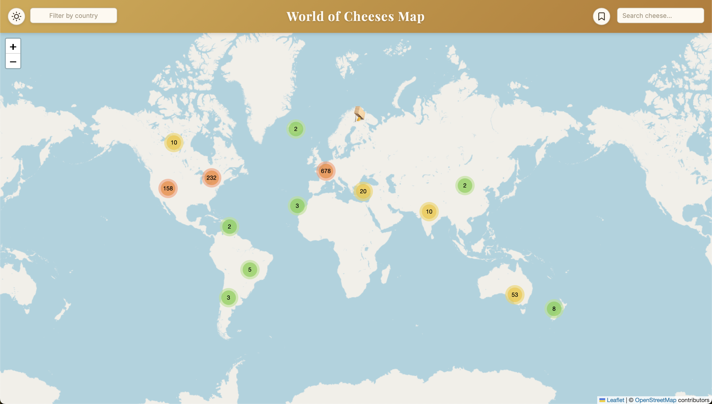
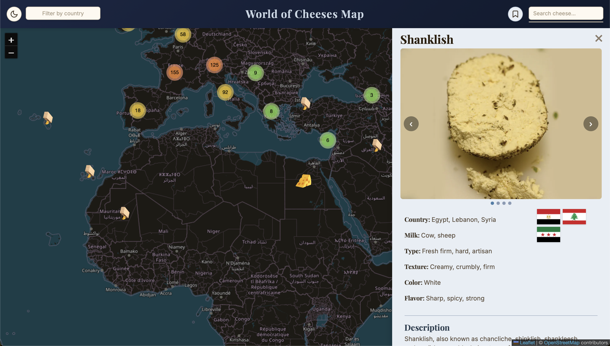
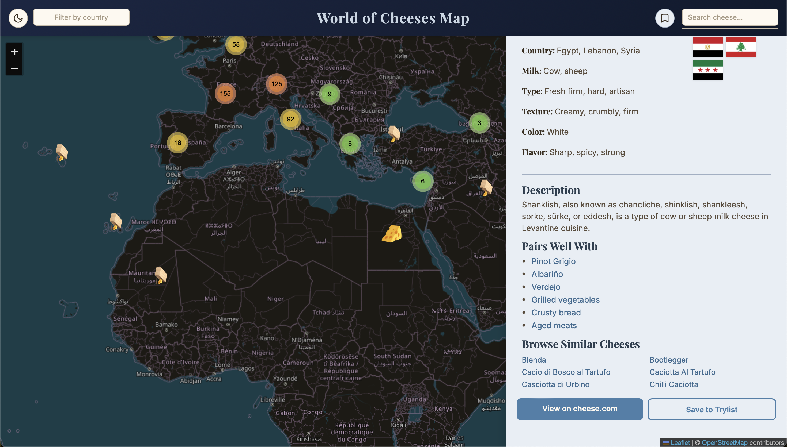
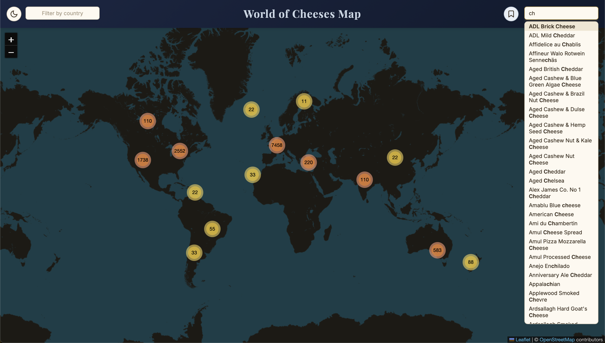
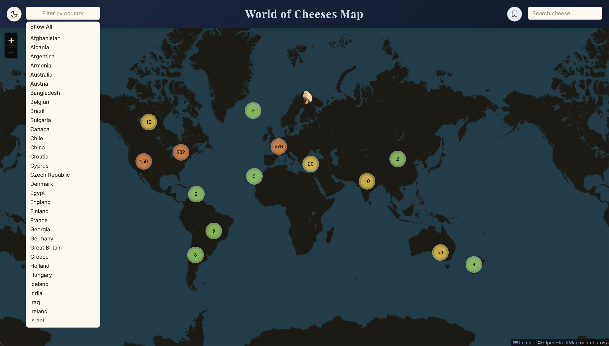
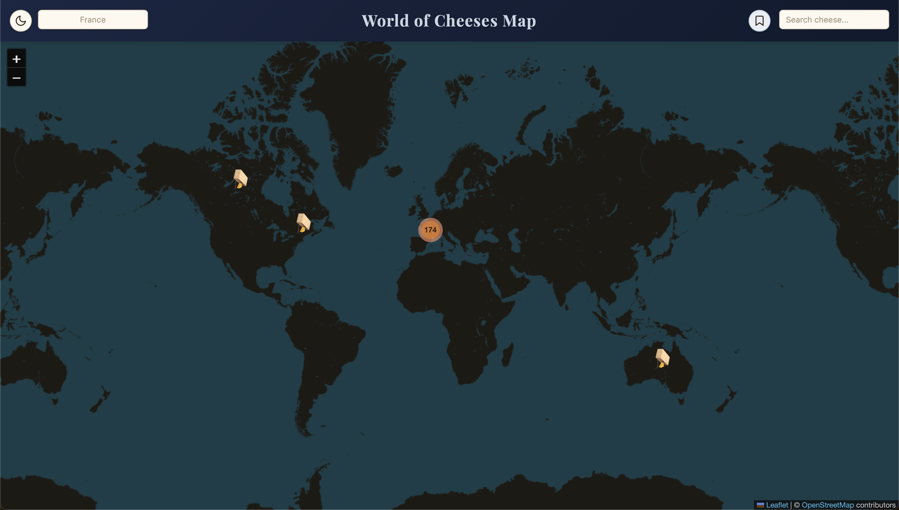
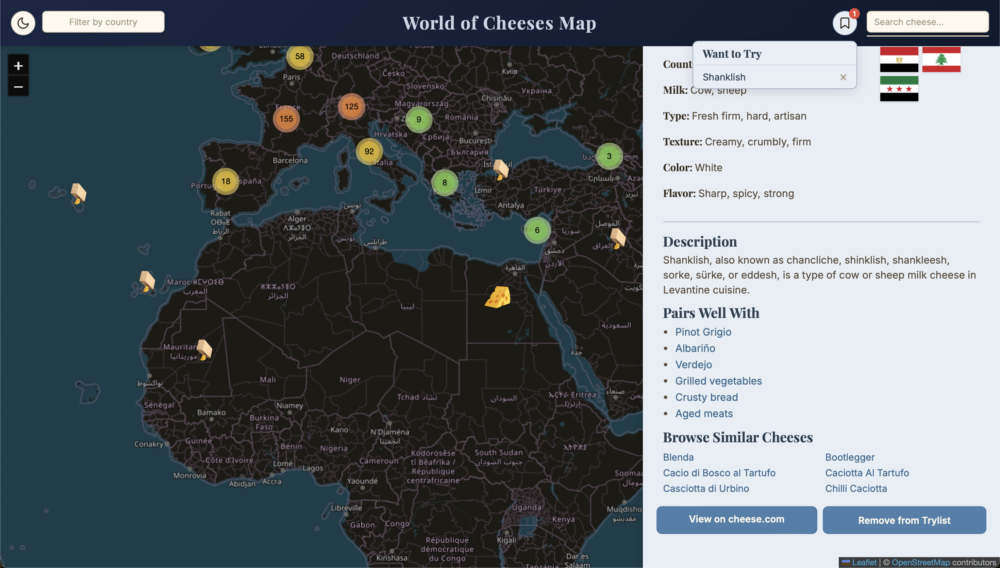
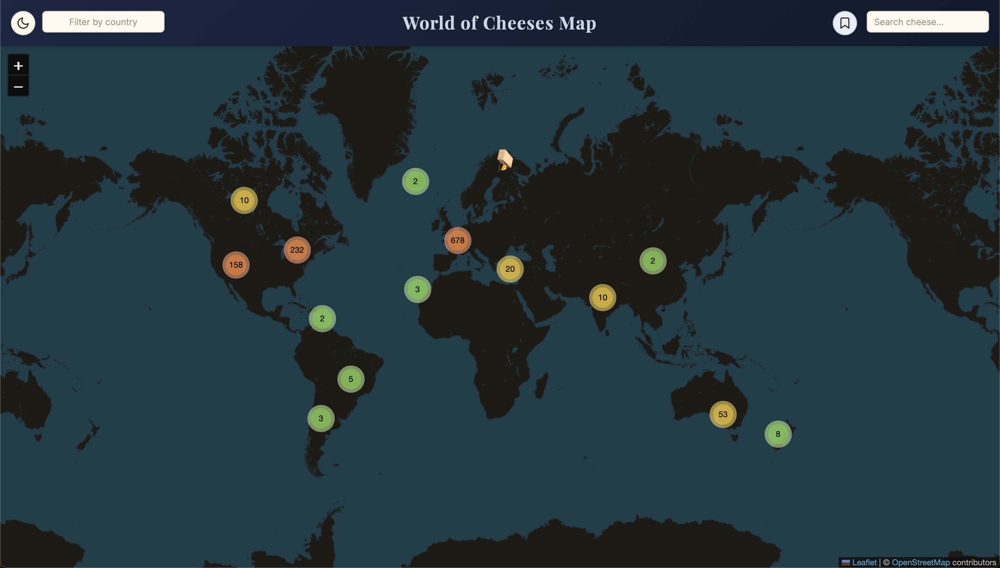

# World of Cheeses Map

An interactive world map showcasing cheeses from around the globe. Explore over 1,000 cheeses by clicking markers on the map, searching by name, or filtering by country of origin.



## Features

### Interactive Map
Cheeses are plotted on a Leaflet map by their geographic origin. Markers are clustered for readability — zoom in to explore individual cheeses in dense regions like Europe.

### Cheese Detail Panel
Click any marker to open a side panel with rich details:
- **Image carousel** with multiple photos scraped from Wikipedia
- Cheese attributes — country, region, milk type, texture, color, flavor
- **Country flag** and **mini-map** highlighting the country of origin
- **Description** and **How It's Made** sections
- **Pairings** — suggested wines and foods (clickable for more info)
- **Similar cheeses** — browse related cheeses by type and milk




### Search
Type in the search box to find cheeses by name. Results appear as a scrollable list — click any result to fly to that cheese on the map.



### Filter by Country
Use the country filter dropdown to narrow the map to cheeses from a specific country.

| Country dropdown | Filtered to France |
|---|---|
|  |  |

### Want to Try Wishlist
Save cheeses you'd like to try. The wishlist persists in the database and is accessible from the top bar.



### Dark / Light Mode
Toggle between light and dark themes using the button in the top bar.

| Light mode | Dark mode |
|---|---|
|  |  |

## Tech Stack

| Layer | Technology |
|---|---|
| Frontend | Vanilla HTML/CSS/JS, Leaflet, leaflet.markercluster |
| Backend | Node.js, Express, Mongoose |
| Database | MongoDB |
| Data Pipeline | Python (requests, geopy, BeautifulSoup) |

## Getting Started

### Prerequisites
- [Node.js](https://nodejs.org/)
- [MongoDB](https://www.mongodb.com/) running locally
- Python 3 with a virtual environment (for the data pipeline only)

### Setup

1. **Clone the repository**
   ```bash
   git clone https://github.com/nshu15/World-of-Cheeses-Map.git
   cd World-of-Cheeses-Map
   ```

2. **Install backend dependencies**
   ```bash
   cd backend
   npm install
   ```

3. **Configure environment variables**

   Create a `.env` file in the project root:
   ```
   MONGO_URI=mongodb://localhost:27017/cheeseDB
   PORT=8000
   ```

4. **Seed the database**
   ```bash
   node backend/data/seed.js
   ```

5. **Start the server**
   ```bash
   node backend/server.js
   ```

6. **Open the frontend**

   Open `frontend/index.html` in your browser, or serve it with any static file server.

## Data Pipeline

The data pipeline transforms raw cheese data into the final seeding-ready JSON. Each script reads from / writes to `backend/data/processed/` and uses file-based caches to avoid redundant API calls.

```
raw/cheeses.json
  → clean_cheeses_json.py        (strip unused fields)
  → geo_cheeses_json.py          (geocode with Nominatim)
  → cheese_img_json.py           (primary image from cheese.com / Wikipedia)
  → cheese_desc_json.py          (description + manufacture from Wikipedia)
  → cheese_images_json.py        (multiple images from Wikipedia)
  → cheese_pairing_json.py       (wine & food pairings by type)
  → pairing_info_json.py         (pairing item metadata → frontend/data/pairing_info.json)
```

To re-run the pipeline:
```bash
cd backend/scripts
source venv/bin/activate
python clean_cheeses_json.py
python geo_cheeses_json.py
python cheese_img_json.py
python cheese_desc_json.py
python cheese_images_json.py
python cheese_pairing_json.py
python pairing_info_json.py
```

## Project Structure

```
World-of-Cheeses-Map/
├── backend/
│   ├── config/db.js
│   ├── data/
│   │   └── seed.js
│   ├── models/
│   │   ├── Cheese.js
│   │   └── SavedCheese.js
│   ├── routes/
│   │   ├── cheeses.js
│   │   └── saved.js
│   ├── scripts/           # Python data pipeline
│   └── server.js
├── frontend/
│   ├── data/
│   │   ├── countries.geo.json
│   │   └── pairing_info.json
│   ├── js/
│   │   ├── api.js
│   │   ├── countryFlags.js
│   │   ├── map.js
│   │   └── ui.js
│   ├── images/
│   ├── index.html
│   └── style.css
├── pic_readme/            # Screenshots for this README
├── .env
├── CLAUDE.md
└── README.md
```